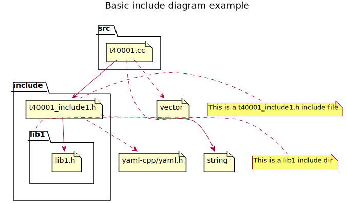

# Generating include diagrams

<!-- toc -->

* [Tracking system headers directly included by project sources](#tracking-system-headers-directly-included-by-project-sources)

<!-- tocstop -->

Include diagrams allow to document the include dependencies among different
parts of the project. This can be very useful for instance to detect that a file
was included from a module directory, on which specific part of the project
should never depend.

The minimal config required to generate an include diagram is presented below:
```yaml
diagrams:
  # Diagram name
  my_class_diagram:
    # Type of diagram (has to be `include`)
    type: include
    # Include only translation units matching the following patterns
    glob:
      - src/*.cc
    # Include also external system headers
    generate_system_headers: true
    # Include only classes and functions from files in `src` directory
    include:
      # Include only files belonging to these paths
      paths:
        - src
```

One distinctive option in `include` diagrams is `relative_to`, which tells
`clang-uml` to render all filename paths relative to this directory.

The following table presents the PlantUML arrows representing relationships in
the include diagrams.

| UML                                     | PlantUML                                 | MermaidJS                                   |
|-----------------------------------------|------------------------------------------|---------------------------------------------|
| Include (local)                         |  |  |
| Include (system)                        |    |   |

## Tracking system headers directly included by project sources

In case you would like to include the information about what system headers your
project files include simply add the following option to the diagram:

```yaml
generate_system_headers: true
```

This will include only system headers directly included from the project's
source files (matched by `glob`) and not their dependencies, for example:



Please note that generating include diagram, which contains third party and
system library headers will result in a huge diagram that is unlikely to
be useful.